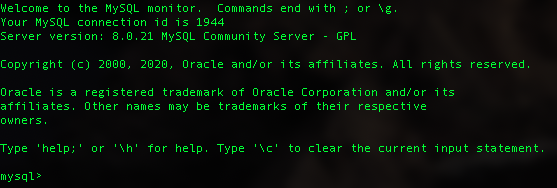
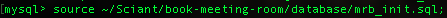

# Guide showing how to run this project locally 
## Table of contents
- ## [Database Initialization](#database-init)
- ## [Running both the Server and Client locally](#running-the-server-and-client)

---
# Database Init

Initialize the database by using the 'mrb_init.sql' sql script

## Running the scirpt on Mac bash terminal
- Check if mysql is insalled on your machine
    - For Mac OS X type the following into terminal: 

    ```mysql is /usr/bin/mysql ```
    - The output if mysql is installed is: 

    ```mysql is /usr/bin/mysql ```
    - The output if mysql isn't installed is: 

    ``` -bash: type: mysql: not found```

- If mysql is not installed then install it before continuing
- Then login into mysql by typing the following command

```mysql -uroot -p```

- Then it should prompt a password entry. Enter the password for the root user
- When you enter successfully it should look something like this


- Now in the mysql console type the file path for the 'mrb_init.sql' script
- The command should look something like this (where your route might be different)



- Now the database is installed. It should have 4 tables called Bookings, Repeats, Rooms, Organizers
    - Rooms and Organizers should have pre-entered data

# Running the server and client

- Since the cocurrently package is installed both the server and client side
    - cd into the main direcotry and run 

    ```npm start``` 
    - The result should say (shown below) before starting the two servers

~~~
> book-meeting-room@1.0.0 start /Users/petr-konstantin/Sciant/book-meeting-room
> concurrently -n 'server,client' -c 'red,green' "nodemon server.js" "cd client && npm start"
~~~

- since nodejs is running using nodemon every save restarts the server
    - Sometimes the port that is used by the server is occupied so just restart (by saving) until the port is free
